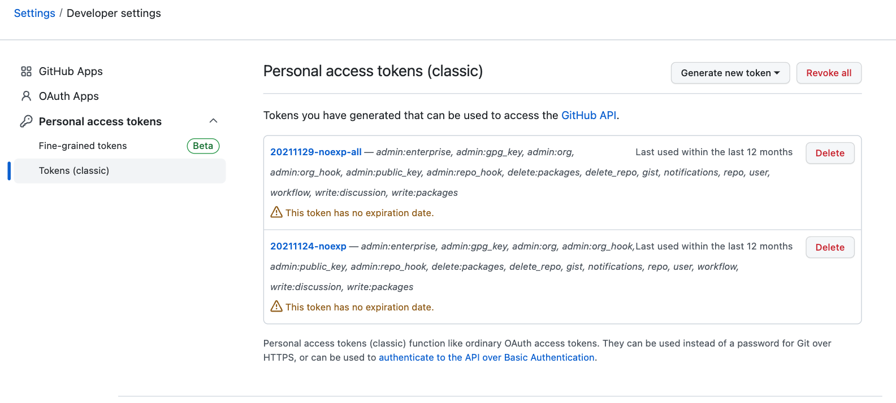

有时候换了常用的git开发环境，在一个新环境上`git clone`，`git push`项目的时候，需要重新输入用户名和密码（token）

在2021年9月的时候，好像github放弃了密码改为token的方式，需要自己生成token并保存

<!--more-->

# 服务器连接github与token配置

## 1. 操作

在github头像 -> Settings -> Developer settings -> Personal access tokens -> Tokens -> Generate new token

这里生成一个新的token，clone等操作的时候用这个token就可以

