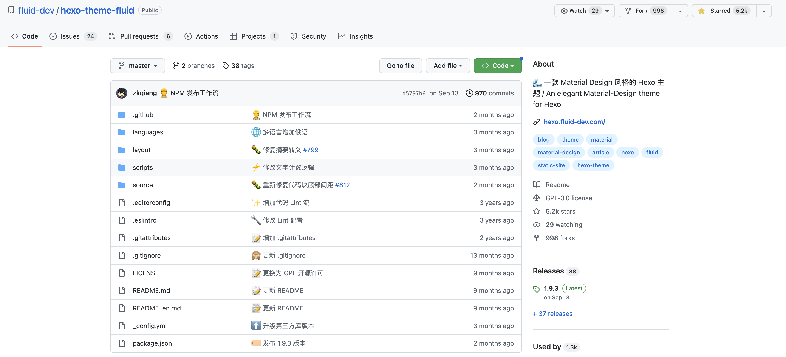

其他hexo相关的博客可能写过主题切换相关，这里再以一个具体实例为例，展示hexo的theme切换过程

目前的material-flow感觉好看，但是有些不实用不简单

<!--more-->

# hexo更换博客主题theme

## 1. 操作

找到一款hexo主题，如：https://github.com/fluid-dev/hexo-theme-fluid

按照其中的quick start安装即可：`npm install --save hexo-theme-fluid`

